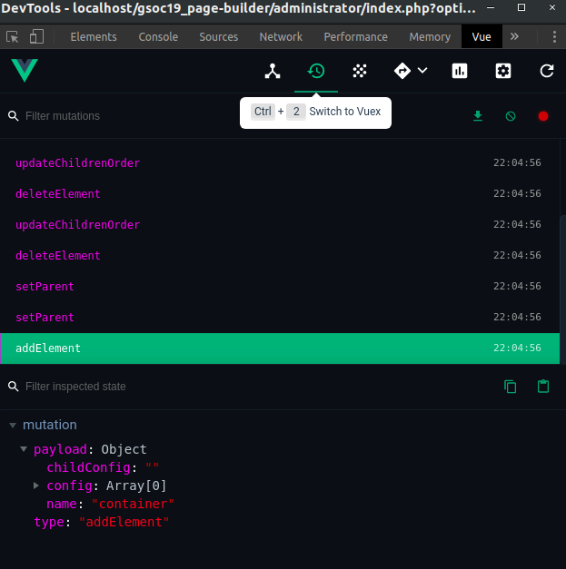

  
  

# GSoC-2019-Page-Builder-Work-Report
Project Students - **Nitish Bahl** ([@bahl24](https://github.com/bahl24)) and **Franciska Perisa** ([@fancyFranci](https://github.com/fancyFranci))
 
Project Mentors - **Benjamin Trenkle** ([@bembelimen](https://github.com/bembelimen)), **Viviana Menzel** ([@drmenzelit](https://github.com/drmenzelit)) and **Anurag Kumar** ([@Anu1601CS](https://github.com/Anu1601CS))
 
 
**Project repository link:** https://github.com/joomla-projects/gsoc19_page-builder/tree/editor
 
**Project Pull Request:** https://github.com/joomla-projects/gsoc19_page-builder/pull/13
 
**Blog Posts** - ([Post1](https://community.joomla.org/gsoc-2019/gsoc-project-page-builder-first-coding-phase.html)) ([Post2](https://community.joomla.org/gsoc-2019/gsoc-project-page-builder-second-coding-phase.html))
 
**Project Documentation** - ([JDocs](https://docs.joomla.org/J4.x:Page_Builder))

## Objective

Imagine someone wants to create a template, but without writing HTML. CSS should be used only for styling and not for defining the layout. Then the Page-builder and the frontend template "Apodis" are helpful tools. The main focus lies on an editor, which makes it possible to create custom-defined positions with the help of a drag & drop GUI. Users can use predefined elements - container, grid, column, module position as well as custom elements. 3rd party developers are able to add their own elements via plugins.

## Open Source Tools/Frameworks used
* [VueJS](https://vuejs.org/)
* [Vuex](https://vuex.vuejs.org/)
* [Webpack](https://webpack.js.org/)
* [Vue.Draggable](https://github.com/SortableJS/Vue.Draggable)
* [VueJSModal](http://vue-js-modal.yev.io/)
* [vue-grid-layout](https://github.com/jbaysolutions/vue-grid-layout)

## Results

### Editor

The Page-builder editor is available in the Template Styles and the appropriate tab. It supports adding new elements, drag and drop to rearrange and position them as per one's liking and the ability to resize columns. Nesting of elements is also available and can be altered by changing the plugin settings. This creates nearly boundless possibilities.

  
  Page Builder Editor

Users can add different elements to the layout by using the "Add Element" button at the bottom of the rows. Then a modal window appears, where they are able to select available elements and set further options directly.

  
  Add elements to the layout

It is possible to add custom CSS classes using the settings icon, present on every element and here users can also add offsets to columns and select name and module chrome for each module position. Plugins are able to offer their own options for the sidebar. The output is a JSON object stored in the parameter field with the type, options, size and children of every element. The editor loads automatically the saved layout from the parameter so that the user can directly continue editing.

### Elements

There are four default elements provided with the Page Builder
1. Container
2. Grid
3. Column
4. Module Position

Existing elements can be modified and additional elements can be added via plugins. A plugin can configure the element and give the structure where it should be available in the editor. For example, it can be only available as root item. When the developer does not want that the element includes others (except module position), the attribute ‘children’ should just be set to ‘false’. The same is possible for parent elements. This way it is not a problem for 3rd party developers to include and customise new elements which are not part of the core functionality. For now, there are some default elements (which can be deactivated) - containers (like Bootstrap containers, elements which set the content in the middle of the page), grids, columns and module positions.

### Apodis

The Page Builder is integrated with a new frontend template named Apodis, which enables users to select, drag and drop their own template styles using the editor. The new template design gets the page-builder elements in index.php and shows the rendered output directly. This is helpful for independent tests, where no stylesheets can interrupt the default behaviour. This is how it works: A com_templates helper function gets called in index.php and recursively iterates through the JSON param obtained from the #_template_styles table, which includes type, position and all the information of saved Page-builder elements. Depending on the type and options, the rendering changes or adds HTML. In the future, the renderer will observe page-builder plugins and their desired rendering too.

### Developing the page builder

The editor interface is primarily built using VueJS, which is an open source JS framework for single page applications and building user interfaces. Vuex is being used to enable multiple VueJS components to get their state from a centralized Vuex store and can reactively and efficiently update whenever the store’s state changes. Using Vuex has made the codebase and architecture of page-builder much more modular, efficient and expandable for future extensions. It also enables us to keep track of events which change state and helps us in debugging using Vue Devtools Extension. The output of the Page Builder is in JSON format, which is stored in a MySQL database on local machine.

  
  Vuex Devtools

## Demo

